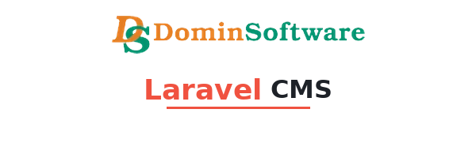

<!--
  This README was regenerated based on your current package and requirements.
-->

<p align="center">
  
</p>

<h1 align="center">dominservice/laravel-cms</h1>

<p align="center">
  Laravel CMS for multilingual content, categories and media (images & video) — integrated with
  <strong>dominservice/laravel-media-kit</strong>.
</p>

<p align="center">
  <a href="https://packagist.org/packages/dominservice/laravel-cms"></a>
  <a href="https://packagist.org/packages/dominservice/laravel-cms/stats"></a>
  <a href="#"></a>
  <a href="#"></a>
  <a href="LICENSE"></a>
  <a href="#support"></a>
</p>

<p align="center">
  <a href="#installation">Installation</a> •
  <a href="#configuration">Configuration</a> •
  <a href="#media-write-backward-compatible--recommended">Upload</a> •
  <a href="#media-read-dynamicavataraccessor">Read</a> •
  <a href="#upgrade-from-v2v3-to-v4-data-migration">Migration v2/v3 → v4</a> •
  <a href="#tests">Tests</a> •
  <a href="#support">Support</a>
</p>

---

> Last updated: 2025-10-17 20:38 UTC

# Table of Contents
- [Highlights](#highlights)
- [Requirements](#requirements)
- [Installation](#installation)
- [Upgrade from v2/v3 to v4 (data migration)](#upgrade-from-v2v3-to-v4-data-migration)
- [Configuration](#configuration)
    - [Tables](#tables)
    - [Disks](#disks)
    - [Profiles & sizes (files.*)](#profiles--sizes-files)
    - [Kind ↔ config mapping (file_config_key_map)](#kind--config-mapping-file_config_key_map)
    - [Logical name mapping (file_kind_map)](#logical-name-mapping-file_kind_map)
- [Models & relations](#models--relations)
- [Media: write (backward-compatible & recommended)](#media-write-backward-compatible--recommended)
- [Media: read (DynamicAvatarAccessor)](#media-read-dynamicavataraccessor)
- [Blade components / Variant URLs](#blade-components--variant-urls)
- [End‑to‑end examples](#endtoend-examples)
- [Tests](#tests)
- [Support](#support)
- [License](#license)
- [Changelog (v4 summary)](#changelog-v4-summary)

## Highlights
- Multilingual **contents** and **categories** (Astrotomic/Translatable).
- Nested categories tree (Nested Set).
- Media (images & video) with `kind` mapped to **MediaKit collection**.
- **DynamicAvatarAccessor** — dynamic names like `avatar_sm`, `video_hd`, `poster_display`; if missing ⇒ returns `null`.
- Content↔Content links with visibility windows and meta.
- Backward-compatible upload methods (`@deprecated`) + new, MediaKit‑based APIs.

## Requirements
- PHP 8.2+, Laravel 9–12
- **dominservice/laravel-media-kit** installed & configured

## Installation
```bash
composer require dominservice/laravel-cms

php artisan vendor:publish --provider="Dominservice\LaravelCms\ServiceProvider"
php artisan vendor:publish --provider="Dominservice\MediaKit\MediaKitServiceProvider"

php artisan migrate
```

> In v4, all media **reads** are served via MediaKit. Legacy storage is migrated once (see below).

## Upgrade from v2/v3 to v4 (data migration)
```bash
php artisan cms:media:migrate-v4
# dry run:
php artisan cms:media:migrate-v4 --dry-run
```
- Detects legacy tables from `config('cms.tables.*')` (e.g. `cms_content_files`, `cms_category_files`, `cms_content_videos`).
- Copies records into MediaKit (`media_assets`) mapping **kind → collection**; video renditions stored in meta.
- On success, **drops** legacy tables. On a clean v4 install: no action.

## Configuration

**CMS:** `config/cms.php`  
**MediaKit:** `config/media-kit.php`

### Tables
- `categories`, `category_translations`
- `contents`, `content_translations`
- `content_categories`
- legacy: `content_files`, `category_files`, `content_video` (migration only)

### Disks
`cms.php` → `disks.*` are historical logical disks; real disk/URL is controlled by MediaKit (`media-kit.php`).

### Profiles & sizes (`files.*`)
Defines logical kinds, default `display` and list of sizes. In v4 it’s a logical contract; variants & URLs are produced by MediaKit.

### Kind ↔ config mapping (`file_config_key_map`)
Aliases one config key to another for `kind` resolution.

### Logical name mapping (`file_kind_map`)
Maps logical names consumed by accessors (e.g. `avatar`, `video_avatar`, `video_poster`) to concrete kinds.

## Models & relations
- `Models\Content`, `Models\Category` (translations, meta).
- MediaKit relation: morph to `MediaAsset` (`model_type`, `model_id`, `collection`).

## Media: write (backward-compatible & recommended)

### Backward‑compatible (deprecated in CMS)
```php
use Dominservice\LaravelCms\Helpers\Media;

// images
Media::uploadModelImage($content, $uploadedFile, 'avatar', null, null, true);
Media::uploadModelResponsiveImages($content, $uploadedFile, 'avatar');
Media::uploadModelImageWithDefaults($content, $uploadedFile, 'avatar');

// video renditions
Media::uploadModelVideos($content, [
  'hd' => $fileHD,
  'sd' => $fileSD
], 'video_avatar');
```

### Recommended (MediaKit)
```php
use Dominservice\MediaKit\Traits\HasMedia;

class Content extends Model {
  use HasMedia;
}

// in your service/controller
$content->addMedia($uploadedFile, 'avatar'); // original + variants by MediaKit
```

## Media: read (DynamicAvatarAccessor)
```php
class Content extends Model {
  use \Dominservice\LaravelCms\Traits\DynamicAvatarAccessor;
}

$content->avatar;         // 'display' variant of 'avatar'
$content->avatar_sm;      // 'sm' variant
$content->video_hd;       // video avatar 'hd'
$content->poster_display; // poster 'display'
```
Missing file/variant ⇒ returns **null** (no exceptions).

## Blade components / Variant URLs
MediaKit exposes route:
```
/media/{{asset-uuid}}/{{variant}}/{{slug?}}
```
Accessors already return such URLs — plug them directly into `` / `<video>`. Blade components from MediaKit can be used alongside existing views.

## End‑to‑end examples

### 1) Upload form + render image
```php
// Controller
\Dominservice\LaravelCms\Helpers\Media::uploadModelImage($content, $request->file('avatar'), 'avatar');

// Blade
avatar ?? asset('img/placeholder.png') }}" alt="avatar">
```

### 2) Video with renditions + poster
```php
// Controller
\Dominservice\LaravelCms\Helpers\Media::uploadModelVideos($content, [
  'hd' => $request->file('video_hd'),
  'sd' => $request->file('video_sd'),
], 'video_avatar');

// Blade
<video controls poster="{{ $content->poster_display }}">
  <source src="{{ $content->video_hd }}" type="video/mp4">
  <source src="{{ $content->video_sd }}" type="video/mp4">
</video>
```

### 3) Gallery (custom kind)
```php
@foreach(($content->gallery_md_list ?? []) as $url)
  
@endforeach
```

## Tests
Edge‑case coverage recommendations:
- missing files/kinds ⇒ returns `null`, no exceptions,
- dynamic names (`avatar_sm`, `video_hd`, `poster_display`, custom kinds),
- migration v2/v3 → v4 on empty DB, with data and in `--dry-run` mode,
- deprecated helper methods delegate to MediaKit,
- integration tests with Laravel app boot (artisan, migrations, storage fake).

## Support
### Support this project (Ko‑fi)
If this package saves you time, consider buying me a coffee: https://ko-fi.com/dominservice — thank you!

## License
MIT — see `LICENSE`.

## Changelog (v4 summary)
- Full read/write integration with **MediaKit**.
- `DynamicAvatarAccessor`: dynamic names, `null` on missing.
- v2/v3 → v4 migration (legacy tables dropped afterwards).
- Deprecated upload methods preserved for smooth transition; new code should use MediaKit APIs.
