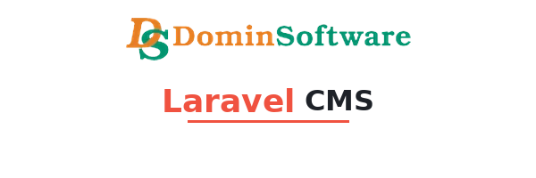

<p align="center">
  
</p>

<h1 align="center">dominservice/laravel-cms</h1>

<p align="center">
  Reusable Laravel CMS for multilingual pages, blocks, categories and media-driven content structures.
</p>

<p align="center">
  <a href="https://packagist.org/packages/dominservice/laravel-cms"></a>
  <a href="https://packagist.org/packages/dominservice/laravel-cms/stats"></a>
  <a href="#"></a>
  <a href="#"></a>
  <a href="LICENSE"></a>
</p>

## What This Package Solves

`dominservice/laravel-cms` is designed for projects that need a practical CMS layer on top of Laravel, without locking the application into a closed website builder.

It gives you:
- multilingual `page` and `block` content models,
- configurable admin sections for content and categories,
- config-driven settings dashboards,
- Media Kit integration for images and video slots,
- publishable views that can be adapted to any admin theme,
- a structure that can start as a company website and grow into a larger CRM, ERP or portal.

## Key Features

- multilingual contents and categories,
- nested category trees,
- configurable admin routes, middleware, layout mode and route names,
- block-oriented homepage and static page management via `cms.default_pages.*`,
- configurable block schemas stored in `meta`,
- repeater fields for cards, FAQ items and similar structured content,
- Editor.js profile support for rich text fields,
- media slots for desktop/mobile image and video handling,
- direct integration with `dominservice/laravel-media-kit`, including reusable library assets,
- publishable views and language files.

## Installation

```bash
composer require dominservice/laravel-cms dominservice/laravel-media-kit

php artisan vendor:publish --provider="Dominservice\LaravelCms\ServiceProvider" --tag=config
php artisan vendor:publish --provider="Dominservice\LaravelCms\ServiceProvider" --tag=views
php artisan vendor:publish --provider="Dominservice\LaravelCms\ServiceProvider" --tag=lang
php artisan vendor:publish --provider="Dominservice\LaravelCms\ServiceProvider" --tag=migrations

php artisan vendor:publish --provider="Dominservice\MediaKit\MediaKitServiceProvider" --tag=mediakit-config
php artisan vendor:publish --provider="Dominservice\MediaKit\MediaKitServiceProvider" --tag=mediakit-migrations

php artisan migrate
```

## Admin Panel

The package includes a configurable admin panel for content, categories and settings.

Main configuration lives in `config/cms.php`:

- `cms.admin.enabled`
- `cms.admin.prefix`
- `cms.admin.route_name_prefix`
- `cms.admin.middleware`
- `cms.admin.layout.mode`
- `cms.admin.layout.view`
- `cms.admin.layout.section`
- `cms.admin.layout.component`

Layout integration supports three modes:

- `package`: use package-provided layout,
- `extends`: render inside your existing Blade layout,
- `component`: render inside a Blade component.

This makes it easy to keep package logic inside the package, while styling the UI in the host project through published views.

## Content Types, Blocks and Schemas

The package supports configurable content and category types. You can keep simple arrays in config or point to your own enum classes.

```php
'types' => [
    'content' => \App\Enums\CmsContentType::class,
    'category' => \App\Enums\CmsCategoryType::class,
],
```

For block-based pages you can define sections in config and assign form fields, media slots and schema fields per section or block.

Typical use cases:
- homepage sections such as `hero`, `about`, `services`, `faq`, `cta`,
- static pages with configurable visual variants,
- reusable block types for landing pages and company websites.

### Schema Fields in `meta`

Block-specific configuration is stored in `meta`, so the host project can render frontend components using its own Blade views and CSS.

Supported patterns include:
- simple scalar fields,
- translatable fields,
- visual variants,
- repeater fields,
- structured button/link configuration,
- Editor.js rich text payloads.

## Media Integration

The package uses `dominservice/laravel-media-kit` as the media layer.

Current integration supports:
- desktop and mobile images,
- desktop and mobile video posters,
- image and video slots in CMS forms,
- importing already uploaded assets from the shared media library,
- keeping CMS views publishable, so the host project can replace the UI without changing package logic.

### Media Picker Configuration

```php
'admin' => [
    'content' => [
        'media_picker' => [
            'enabled' => true,
            'browse_route' => 'admin.media.index',
            'label' => 'Biblioteka mediów',
            'helper' => 'Wybierz istniejący asset z biblioteki lub wgraj nowy plik.',
        ],
    ],
],
```

The package exposes backend support for selecting library asset UUIDs. The host project can publish and extend the form views to provide a custom picker UX.

## Editor.js Profiles

The package supports Editor.js configuration profiles so projects can choose a richer or more compact toolset per field.

Example:

```php
'admin' => [
    'content' => [
        'editorjs' => [
            'profiles' => [
                'default' => [
                    'tools' => ['paragraph', 'header', 'list', 'quote'],
                ],
                'compact' => [
                    'tools' => ['paragraph', 'list'],
                ],
            ],
            'field_profiles' => [
                'description' => 'default',
                'faq_items.answer' => 'compact',
            ],
        ],
    ],
],
```

## Settings Dashboard

The settings dashboard is driven by configuration and can sync UUID-based assignments back into structured config arrays.

Useful for:
- assigning homepage page UUIDs,
- assigning homepage blocks,
- syncing public menu structures,
- storing multilingual meta fields,
- managing config-driven CMS sections without writing extra controllers.

## Views and Overrides

The package is meant to be published and themed.

```bash
php artisan vendor:publish --provider="Dominservice\LaravelCms\ServiceProvider" --tag=views
php artisan vendor:publish --provider="Dominservice\LaravelCms\ServiceProvider" --tag=lang
```

Recommended approach:
- keep routes, controllers, Livewire classes and storage logic in the package,
- publish package views,
- override the views in the host project to match the chosen admin theme.

This keeps the CMS reusable between projects while still allowing tailored UI.

## Extensibility

The package is intentionally config-first and open to project-level extension.

You can extend it through:
- your own enum classes for content and category types,
- additional block schemas in app config,
- published views,
- custom frontend renderers,
- custom permissions and middleware on admin routes,
- custom settings panels and sync indexes.

## Upgrade Notes

When upgrading existing projects:
- merge new config keys instead of overwriting the whole file,
- republish views only if you want the new default UI,
- republish migrations only when needed,
- verify `media-kit` config and routes if you use the shared media library.

## License

MIT
